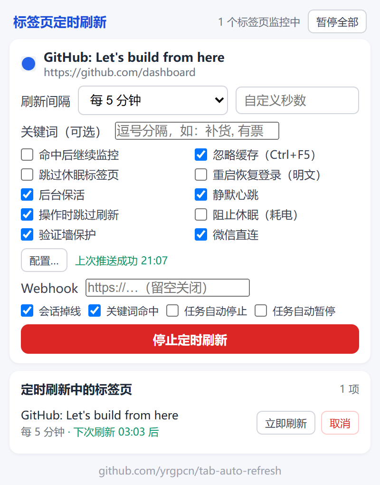

# Tab Auto Refresh

轻量的 Chrome 标签页定时刷新扩展。为任意标签页设置自动刷新间隔，支持全局暂停、快捷键与中英文界面。

## 功能特性

- 预设间隔：30 秒 / 1 分钟 / 2 分钟 / 5 分钟 / 10 分钟 / 30 分钟 / 1 小时
- 自定义间隔：可输入任意秒数，最小 30 秒
- 右键菜单：在网页或标签页上右键快速设置刷新间隔
- 快捷键：`Alt+Shift+R` 开关当前标签页的定时刷新，启动时沿用上次设置的间隔
- 全局暂停：弹窗一键暂停或恢复全部任务，角标同步显示暂停状态（暂停只停自动刷新；静默心跳与后台保活继续，维持登录会话不过期）
- 任务管理：弹窗列出所有监控中的标签页，带倒计时
- 立即刷新：可手动触发一次刷新
- 忽略缓存：可选 Ctrl+F5 强制刷新（默认开启）
- 跳过休眠：可选不唤醒已被浏览器丢弃的标签页
- 登录保持（默认关闭）：开启后备份站点 cookie（含父域 SSO 票据，采集范围以该站点的注册域为界，公共后缀不会被当成站点，因此不会读到无关站点的票据），浏览器重启后自动恢复登录态。备份在本机明文存储，请先读[安全说明](#安全说明)
- 后台保活（默认开启）：向监控页面按标签页注入模拟鼠标键盘活动，延缓按用户交互计时的服务器端登录过期；检测到会话已被服务器注销时暂停覆盖备份并通知，详见[使用边界](#使用边界与验证)
- 静默心跳（默认开启）：每 4 分钟向监控地址发一次带 cookie 的后台请求，不重载页面、不打扰阅读，专门续住按最后请求计时的服务器端会话
- 关键词监控（可选）：建任务时可填多个关键词，用逗号分隔。页面加载后自动延迟重采样（SPA 迟渲染也能等到），命中即发系统通知；正文检测算上页面里的框架（iframe 内的文字同样能命中）。默认命中后停止任务，勾选"命中后继续监控"则持续盯守，只有新出现的关键词才再次通知。弹窗会按当前页面这条任务回填已填的关键词、"命中后继续监控"和它实际用的间隔，改它们不必先停掉再重开
- Webhook 通知（默认关闭）：配置 URL 后，会话掉线、关键词命中、任务自动停止、任务自动暂停会以 JSON POST 推给你（Discord / Slack / Telegram 直接出可读文案；ntfy 能送达，但正文是原始 JSON 文本）。人不在电脑前也能收到。载荷里含被监控页面的地址（只发 `origin + 路径`，查询参数一律剪掉）和你填的关键词原文，见[安全说明](#安全说明)
- 微信直连通知（默认关闭）：扩展直接调腾讯官方接口，把通知推成微信模板消息，不经任何中继服务器、也不用第三方推送服务商，手机上不用装 App。填入微信"公众平台接口测试账号"的四项凭据即可（扫码申领、免资质、免费），与 Webhook 共用"通知哪些事件"的勾选。配置步骤见 `tab-auto-refresh/wechat-setup.html`，弹窗的微信配置页有"配置教程"直达。卡片文案是压缩过的：微信规定模板消息单个字段最多 20 个字且不能换行，所以标题是"事件 · 站点"、正文是一句话结论，完整的页面地址不占字数，点一下卡片就会打开它（跳转地址与其他通知一样不带查询参数）。凭据随设置同步，见[安全说明](#安全说明)
- 异常自动暂停：监控页面持续返回错误（5xx/404）或出现人机验证墙时自动暂停该任务并通知，角标显示 `⚠`。错误页恢复后自动继续，验证墙过墙后可手动恢复。验证墙探测只看页面标题和验证服务的来源域名，不扫页面正文（正文里的"验证码"是日常词，误判成墙会让任务卡在暂停态且不自愈）；整页挑战嵌在 iframe 里也能检出，reCAPTCHA 这类挂件尺寸的验证框不算墙；页面里有个别框架注入不进去时退回顶层继续探测。默认开启，可在弹窗的"验证墙保护"里关闭
- 尊重你的操作（默认开启）：开启后你在页面上真实操作的 60 秒内跳过刷新，不打断填表和阅读；保活注入的模拟活动不会被误判成你的操作。另有第二条判据兜底：这一页正是你当前窗口里看着的那个标签页时也跳过，专治注入失败（受限页、站点权限）导致"报了活动却没报"的页面。认不出焦点窗口时按"没在看"处理，宁可多刷一次也绝不变成永不刷新
- 防系统休眠（默认关闭）：有任务运行时阻止电脑因闲置而睡眠，让无人值守盯页面真正成立。笔记本电池场景慎用
- 同步设置：偏好设置通过 `chrome.storage.sync` 跨设备同步
- 持久化：浏览器重启后任务自动继续
- 自动重开：误关监控中的标签页会自动重新打开并继续任务
- 站点锁定：监控页面漂移到其他网站时自动导航回来，同站（含子域登录跳转）正常跟随
- 自动清理：标签页失效或刷新失败时自动取消任务并通知
- 角标提示：工具栏图标显示监控数量；全局暂停是 `‖`（灰），站点会话失效是 `!`（红），提醒重新登录；任务被异常自动暂停是 `⚠`（橙）
- 通知可点开、会自己收：关键词命中、任务自动停止、异常自动暂停、站点待重登这四类系统通知，点一下就跳到对应标签页并把它所在的窗口带到前台；重新开始任务、从暂停恢复、重新登录后对应的通知会自动收掉，不会留在通知中心里让你对着上个周期的结论做判断
- 中英文界面：自动跟随浏览器语言

## 安装方法

1. 下载最新 Release 的 zip 并解压，或克隆仓库：`git clone https://github.com/yrgpcn/tab-auto-refresh.git`
2. 打开 `chrome://extensions`，开启"开发者模式"
3. 点"加载已解压的扩展程序"，选择 `tab-auto-refresh/` 文件夹

## 安全说明

"重启后恢复登录"默认关闭。开启后，插件会把监控站点的 cookie（含 HttpOnly 的登录票据）备份到本机的扩展存储 `chrome.storage.local`，该存储不做加密，任何能读取浏览器配置目录的程序都可以直接取走这些登录票据，安全性低于 Chrome 自身的加密 cookie 库。备份最多保留 20 个站点、30 天。请只在信任本机环境、且确有重启保登录需求时开启；不需要时保持关闭即可，关闭状态下不备份、不恢复，遗留备份也会被自动清除。

Webhook 通知默认关闭。开启后，每当所选事件发生，插件会向你配置的 URL POST 一条 JSON。载荷里包含被监控页面的地址（只到 `origin + 路径`，查询参数一律剪掉——工单与后台系统这类网址常把一次性签名、会话令牌、邮箱手机号挂在 `?` 后面，而"跳回哪一页"并不依赖它们）、站点主机名、事件类型与时间戳；如果你给这个页面配了关键词监控，你填的那几个字也会原样发出去，因为"命中了哪个词"就是这条通知的内容本身。这意味着"你在监控哪些页面、盯的是哪些词"会披露给该端点及其链路上一切可见方，比如第三方消息服务的服务器。还有一件容易忽略的事：**你填的这个 webhook 地址本身就是一把凭据**——这类地址通常内嵌 token，谁拿到就能往你的频道里发消息，而它和其他偏好设置一起存在 `chrome.storage.sync`，会随 Google 账号同步到你登录同一账号的每一台桌面 Chrome。请只配置你自己信任的端点，也别把这个地址贴到 issue 或截图里；不需要时留空即为彻底关闭，不建连、不发任何出站请求。

微信直连通知默认关闭。开启后，通知由扩展的 service worker 直接发往腾讯官方接口 `api.weixin.qq.com`，链路里没有中继服务器、也没有第三方推送服务商，手机不需要安装任何 App。要留意的是凭据的存放位置：四项凭据（appID、appsecret、openid、模板 ID）随偏好设置存放在 `chrome.storage.sync`，如果你在 Chrome 里登录了 Google 账号并开启同步，它们会同步到每一台登录了同一账号的桌面 Chrome。其中 appsecret 是唯一一把能以该公众号名义发消息的钥匙，别贴到 issue 或截图里；弹窗里那一格也不再回显输入内容（圆点显示，粘贴照常），但掩码只挡得住屏幕旁边的眼睛，上面说的明文存放与跨设备同步一点都没因此改变。不需要时关掉开关即彻底停用，不发任何出站请求。

## 使用边界与验证

- 保活能救什么、救不了什么：服务器端踢下线通常按三种机制之一计时。一是按最后一次用户交互计时，后台保活注入的模拟活动可以续命；二是按最后一次 HTTP 请求计时，静默心跳每 4 分钟发一次带 cookie 的后台请求即可续住，无需重载页面；三是绝对时长上限，比如登录后固定 N 小时强制失效，任何手段都救不了。前两种有解，第三种无解。
- 保活与心跳的前提：机器保持开机不休眠，浏览器保持开启。"不休眠"这一条可以交给"防系统休眠"开关（`chrome.power`，默认关闭）代劳，有任务时自动阻止闲置睡眠；但"浏览器保持开启"仍是硬前提，脚本运行在页面里、心跳由浏览器发出，浏览器一关都随之停止。这种关机窗口只能靠登录保持在重启后恢复，两者互补。
- 保活可能无效的场景：站点若校验事件的 `isTrusted`（拒绝程序合成事件），或在页面 `document.hidden` 时暂停心跳计时，注入的模拟活动就不起作用；静默心跳对把异常规律请求纳入风控的站点也可能无效。这类限制由对方服务器决定，绕不过去。
- 会话失效检测（双通道）：状态通道是，若已开启登录保持，某次备份发现会话 cookie 从有到无，先记一次疑似，不会用坏样本覆盖好备份，连续 2 次才判定服务器端注销，随后暂停覆盖该站点备份（保住最后一次有效登录态不被坏状态污染）并弹通知提醒重新登录；行为通道是，任务页落在登录页 URL，或静默心跳收到重定向到登录页、401、403 响应，同样计入确认。确认后角标变红 `!`，重新登录后自动恢复正常备份与角标。
- 站点锁定的边界：如果你想在同一个标签页里手动换到别的网站使用，插件到刷新周期会把该标签页导航回原监控页面，这是设计使然。想更换监控对象，请先停止任务，再在新页面重新开启。
- 验证方式：重新加载扩展（或加载最新 Release 的 zip），对某页面开启监控（间隔选 30 秒便于观察），在页面里点一个外部链接跳走，等下一次刷新，标签页会自动导航回原监控页面。

## 技术栈

- Manifest V3（Chrome 扩展最新规范）
- Background Service Worker（后台定时任务）
- Chrome Extensions API（Alarms / Storage / Context Menus / Tabs / Cookies / Notifications）

## 项目结构

- `tab-auto-refresh/`：插件源码（manifest、后台、弹窗、微信直连配置教程页、共享逻辑、语言包、图标）。其中 `wechat-setup.html` 既是弹窗里"配置教程"指向的页面，也是仓库里的这份教程本身，同一份文件，不存在两处内容各自漂移
- `tests/`：纯逻辑单元测试
- `scripts/`：仓库校验与弹窗截图脚本
- `docs/`：README 用的截图等文档资源
- `.github/workflows/`：CI 与 tag 驱动的自动发布

## 开发与测试

- 仓库校验与单元测试：`node scripts/validate.mjs`、`node --test "tests/**/*.test.mjs"`，CI 自动执行。这两条不需要 `npm install`，脚本只用 Node 内置模块
- 弹窗截图：`scripts/screenshot-popup.mjs`，mock chrome API 后用本机 Chrome 渲染
- 发布：改 `tab-auto-refresh/manifest.json` 版本号并更新 `CHANGELOG.md`，打 tag `tab-auto-refresh/vX.Y.Z` 并推送，Actions 自动打包并创建 GitHub Release，只保留最新 Release 与 tag

## 开发环境

- Chrome 120+
- Node.js（用于仓库校验、单元测试与弹窗截图脚本）

## License

MIT
