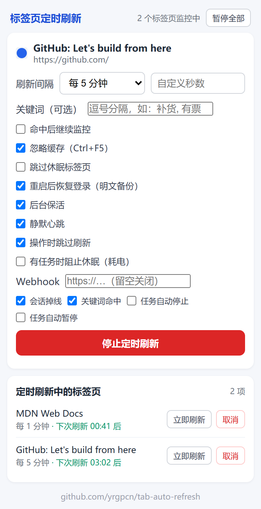

# tab-auto-refresh 标签页定时刷新

Chrome 浏览器扩展：为任意标签页设置定时自动刷新。

## 功能特性

- 预设间隔：30 秒 / 1 分钟 / 2 分钟 / 5 分钟 / 10 分钟 / 30 分钟 / 1 小时
- 自定义间隔：支持输入任意秒数（最小 30 秒）
- 右键菜单：在网页或标签页上右键快速设置刷新间隔
- 快捷键：`Alt+Shift+R` 开关当前标签页的定时刷新，启动时使用上次设置的间隔
- 全局暂停：弹窗一键暂停 / 恢复全部任务，角标同步显示暂停状态
- 任务管理：弹窗查看所有监控中的标签页，带倒计时
- 立即刷新：可手动触发一次刷新
- 忽略缓存：可选 Ctrl+F5 强制刷新（默认开启）
- 跳过休眠：可选不唤醒已丢弃（休眠）的标签页
- 同步设置：偏好设置通过 `chrome.storage.sync` 跨设备同步
- 持久化：浏览器重启后任务自动继续
- 自动重开：误关监控中的标签页会自动重新打开并继续任务
- 登录保持：定期备份站点 cookie（含父域 SSO 票据），浏览器重启后自动恢复登录态
- 站点锁定：监控页面漂移到其他网站时自动导航回来；同站（含子域登录跳转）正常跟随
- 自动清理：标签页失效或刷新失败时自动取消任务并通知
- 角标提示：工具栏图标显示当前监控数量
- 中英文界面：自动跟随浏览器语言

## 安装方法

1. 打开 `chrome://extensions`，开启「开发者模式」
2. 点「加载已解压的扩展程序」，选择本目录（`tab-auto-refresh/`）

## 使用边界与验证

- **站点锁定的边界**：如果你想在同一个标签页里手动换到别的网站使用，插件到刷新周期会把该标签页导航回原监控页面，这是设计使然。想更换监控对象，请先停止任务，再在新页面重新开启。
- **验证方式**：重新加载扩展（或加载最新 Release 的 zip）→ 对某页面开启监控（间隔选 30 秒便于观察）→ 在页面里点一个外部链接跳走 → 等下一次刷新，标签页会自动导航回原监控页面。

## 技术栈

- Manifest V3（Chrome 扩展最新规范）
- Background Service Worker（后台定时任务）
- Chrome Extensions API（Alarms / Storage / Context Menus / Tabs）

## 开发与测试

- 校验与单元测试：`node scripts/validate.mjs`、`node --test tests/`（CI 自动执行）
- 弹窗截图：`scripts/screenshot-popup.mjs`（mock chrome API 后用本机 Chrome 渲染）

## 开发环境

- Chrome 120+
- Node.js（用于脚本生成图标等资源）
